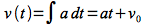
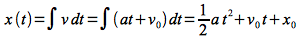
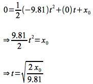
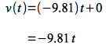

Due: 

Getting Started
===============

Download [freefalling.zip](freefalling.zip).  Unzip it in the directory where you store your course projects.  You should now have a directory called **freefalling**.  In a terminal window, change directory to the **freefalling** directory.

Your Task
=========

Your task is to write a program that prompts the user to enter the height of an object dropped from rest (neglecting air resistance). The program should then print out the object's time to fall to the ground and velocity at impact in several different units including

- meters/sec
- ft/sec
- miles per hour

Here is an example run of the program (user input in **bold**):

<pre>
Enter the initial height of the object in meters: <b>50</b>
The object took 3.19 seconds to fall.
The velocity of the object at impact was:   31.3 m/sec
                                           102.7 ft/sec
                                            70.1 mph
</pre>

The time field should have two decimal places of precision. All of the velocity values should allow for up to four digits *in front* of the decimal point and one digit *after* the decimal point such that the decimal points are aligned in the final output.

Grading
=======

70% level - obtain user input and properly compute the time

80% level - compute the final velocity in m/sec

90% level - compute the final velocity in ft/sec and mph

100% level - format the output correctly

Hints
=====

Physics
-------

The basic physics (which many of you will learn this semester in PHY160) governing an object falling only under the influence of gravity (neglecting air resistance) is integration of the acceleration (which for the earth is -9.81 m/sec) with respect to time. Hence the velocity of the object as a function of time is given by

> 

where *v(t)* is the velocity at time *t*, *a* is the acceleration due to gravity (-9.81 m/sec), and *v*0 is the initial velocity (which for this assignment is 0).

The position of the object as a function of time is found by integrating the velocity with respect to time as follows

> 

where *x(t)* is the position at time *t* and *x*0 is the initial position (which for this assignment is the value entered by the user).

Therefore we can find the *time* the object falls in seconds by solving the above equation for *t* setting *x(t)* = 0, *a* = -9.81, *v*0 = 0

> 

where *x*0 is given in meters. Once the time is computed, the velocity at impact is computed from the velocity equation as (again setting *v*0 and *a* = -9.81)

> 

Note the velocity will be negative indicating the object is moving downward, but your output should only show the positive magnitude.

Some useful conversions

> -   3.28 feet in a meter
> -   3600 seconds in an hour
> -   1609 meters in a mile

**USE** the computer to compute the conversion factors for the velocity units by simply writing expressions in your program and storing the results in variables.

Programming
-----------

**START EARLY! And develop the program incrementally!** You should always have a working program at each step (even if only minimally) to make it easier to debug errors. For example, make sure the program obtains the user input properly and then add one computation at a time. Also make sure you follow good programming practices such as **adding comments**, **using meaningful variable names**, and **having proper indentation in the program**.

The square root function in C is

    sqrt(x)

which returns a **double** value which is the square root of *x*. You will need to include the **math.h** library by adding the following line at the top of your program

    #include <math.h>

You will need to specify precision and field width when printing the result values.  For example, if you want to print a **double** value with 4 digits before the decimal point and one digit after the decimal point, you would use the conversion specifier `%6.1lf`.  (Six total characters of output and one digit after the decimal point.  Note that the decimal point itself counts as one character of output, allowing up to four digits before the decimal point.)

Submitting
==========

